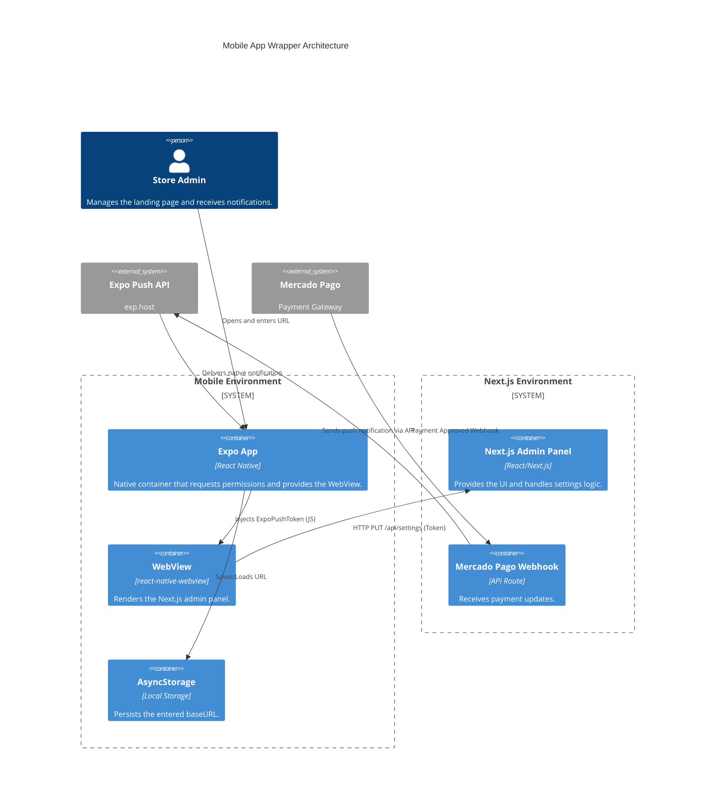
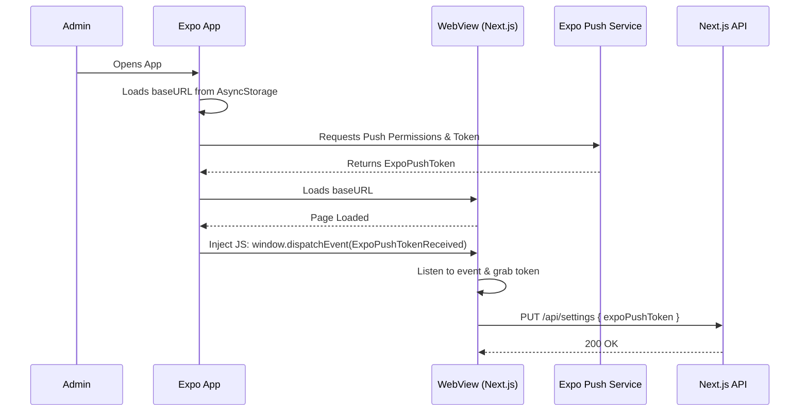

# Architecture Diagrams

## C4 Container Diagram

```mermaid
C4Context
    title Mobile App Wrapper Architecture

    Person(admin, "Store Admin", "Manages the landing page and receives notifications.")
    
    System_Boundary(mobile, "Mobile Environment") {
        Container(app, "Expo App", "React Native", "Native container that requests permissions and provides the WebView.")
        Container(webview, "WebView", "react-native-webview", "Renders the Next.js admin panel.")
        Container(asyncStorage, "AsyncStorage", "Local Storage", "Persists the entered baseURL.")
    }

    System_Boundary(backend, "Next.js Environment") {
        Container(nextjs, "Next.js Admin Panel", "React/Next.js", "Provides the UI and handles settings logic.")
        Container(webhook, "Mercado Pago Webhook", "API Route", "Receives payment updates.")
    }

    System_Ext(expoPush, "Expo Push API", "exp.host")
    System_Ext(mercadopago, "Mercado Pago", "Payment Gateway")

    Rel(admin, app, "Opens and enters URL")
    Rel(app, asyncStorage, "Saves/Loads URL")
    Rel(app, webview, "Loads URL")
    Rel(webview, nextjs, "HTTP GET")
    Rel(app, webview, "Injects ExpoPushToken (JS)")
    Rel(webview, nextjs, "HTTP PUT /api/settings (Token)")
    
    Rel(mercadopago, webhook, "Payment Approved Webhook")
    Rel(webhook, expoPush, "Sends push notification via API")
    Rel(expoPush, app, "Delivers native notification")
```

## Push Notification Registration Flow

```mermaid
sequenceDiagram
    participant User as Admin
    participant App as Expo App
    participant Web as WebView (Next.js)
    participant Expo as Expo Push Service
    participant API as Next.js API

    User->>App: Opens App
    App->>App: Loads baseURL from AsyncStorage
    App->>Expo: Requests Push Permissions & Token
    Expo-->>App: Returns ExpoPushToken
    App->>Web: Loads baseURL
    Web-->>App: Page Loaded
    App->>Web: Inject JS: window.dispatchEvent(ExpoPushTokenReceived)
    Web->>Web: Listen to event & grab token
    Web->>API: PUT /api/settings { expoPushToken }
    API-->>Web: 200 OK
```
